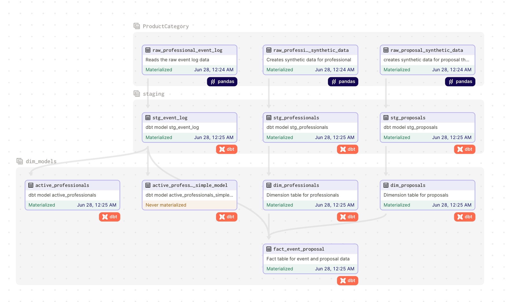

# Dagster with DBT Project

This project showcases an orchestration workflow using Dagster and data modeling using DBT. The project is deployed within a Docker container with a separate PostgreSQL instance. It enables the creation of Fact and Dimensional models based on raw and staging data, using data assets sourced from a CSV file. Additionally, synthetic data is introduced to support the modeling process.

## Project Structure 

The project has the following structure 
```
.
├── dbt_project
│  ├── analyses
│  ├── config
│  │  └── profiles.yml
│  ├── dbt_packages
│  ├── dbt_project.yml
│  ├── macros
│  ├── models
│  │  ├── dim_models
│  │  │  ├── active_professionals.sql
│  │  │  ├── active_professionals_simple_model.sql
│  │  │  ├── dim_professionals.sql
│  │  │  ├── dim_proposals.sql
│  │  │  ├── fact_event_proposal.sql
│  │  │  └── schema.yaml
│  │  ├── schema.yml
│  │  ├── sources.yml
│  │  └── staging
│  │     ├── stg_event_log.sql
│  │     ├── stg_professionals.sql
│  │     └── stg_proposals.sql
│  ├── README.md
│  └── tests
│     ├── test_dim_professionals.sql
│     ├── test_dim_proposals.sql
│     └── test_fact_event_proposal.sql
├── docker
│  ├── dagster.yaml
│  ├── Dockerfile
│  └── metabase.Dockerfile
├── docker-compose.yml
├── gitlab-ci.yml
├── Makefile
├── ownerjobs
│  ├── __init__.py
│  ├── __main__.py
│  ├── assets
│  │  ├── __init__.py
│  │  └── assets_read.py
│  ├── io
│  │  ├── db_io_manager.py
│  │  └── pg_db_io_manager.py
│  ├── raw_data
│  │  └── event_log.csv
│  ├── resources
│  │  └── db.py
│  └── utils
│     └── constants.py
├── ownerjobs_tests
│  ├── __init__.py
│  ├── test_defs.py
│  ├── test_random_email.py
│  └── test_random_string.py
├── readme-docs
│  ├── lineage.png
│  └── Tree.txt
├── README.md
├── requirements-dev.txt
├── requirements.txt
└── workspace.yaml

```

## Getting Started
To run the project, follow these steps:

1. Ensure you have Docker installed on your machine
2. Clone this repository to your local machine
3. Navigate to the project's root directory.
4. Start the Docker containers using the following command:
    make start_the_docker_normal_mode
    Or 
    make start_the_docker_with_no_cache
5. Once the containers are up and running, access the Dagster UI at http://localhost:3333. And BI-Tool metabase can be accessed at http://localhost:3000
    
    
## Asset Lineage 
0. The main code for reading Assets and DBT project is written in   ownerproject/__init__.py
1. The assets are defined in ProductCategory group. That run python code for data ingestion or creating synthetic data. 
2. Once they are sucessfully materalised it connects with the staging layer. Staging models use the raw outputs. 
3. Staging models will transform into the dimensional models. Which eventually leads to the creation of FactModel. 
4. These pipelines are scheduled for daily run around 12:00 using a CRON scheduler.  

     
